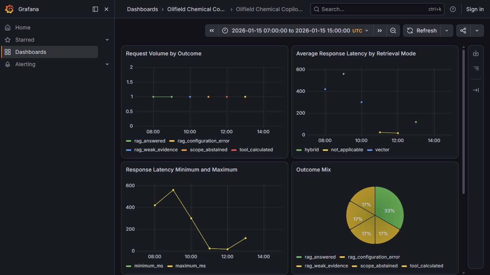

# Module 5 Monitoring Verification

**Date:** 2026-08-15
**Scope:** Local Docker Compose monitoring path with fixed synthetic aggregate data.

## Result

- The dedicated monitoring migration completed and created the aggregate-only schema.
- Grafana role bootstrap completed with a role limited to the two monitoring aggregate tables.
- The explicit synthetic seed completed.
- Aggregate validation recorded 6 request events and 2 feedback events.
- Grafana provisioned the datasource and the dashboard.
- All six panels rendered with populated synthetic data in the fixed UTC demo window.

## Dashboard Evidence



The screenshot shows only deterministic aggregate demo values. It contains no application prompts, answers, citations, source metadata, identifiers, credentials, database URLs, or private material.

## Privacy Boundary

The runtime persistence contract accepts only closed outcome and retrieval-mode values, UTC hourly buckets, aggregate latency values, feedback values, and counts. Grafana reads only the aggregate request and feedback tables through a read-only role. The demo seed is explicit and fixed; it does not query corpus or Streamlit-history data.

## Reproduction

```powershell
docker compose up -d --build postgres monitoring-migrate grafana-role-init grafana
docker compose --profile demo run --rm monitoring-demo-seed
```

Open `http://localhost:3000` and use the preconfigured synthetic UTC window. Run `docker compose down` to stop the local stack.

## Scope Limits

This validates a local dashboard and a synthetic review path. It does not claim deployment, alerting, production telemetry volume, chemistry correctness, or operational readiness.
